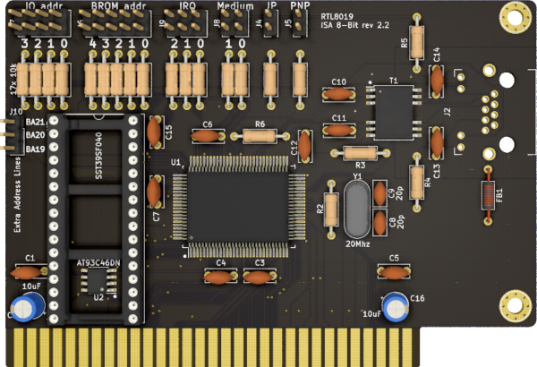

# RTL8019AS ISA 8bit Network Card

## Introduction

This is an 8bit reimplementation and repackaging of [Manawyrm's ISA8019](https://github.com/Manawyrm/ISA8019), a NE2000-compatible card for the ISA bus.

Differences from the original version include:
- 8bit only design (significantly more compact than the 16bit version)
- Most of the components are now THT (except EEPROM, Network IC and transformer)

### Disclaimer

I take NO responsibility for what happens if you decide to build and use this card. Your computer might crash, catch fire or be destroyed in other nasty ways.
Also, as this card is mostly based on the work of others, You're encourauged to take what you deem fit from this, and use it in your projects!

Additionally, do **NOT CONTACT Manawyrm FOR SUPPORT**, while this board is derived from their work, it is not their product, please do not waste their time.

## Configuration

The board can work in 3 modes:
- Jumper mode (JP jumper set)
This mode allows for manual configuration of any parameters (I/O address, IRQ, BROM address & size, etc.) manually via jumpers. Refer to the back of the PCB for details. 
- EEPROM mode (also called "Jumperless", no jumpers set)
In this mode, all parameters can be configured via the RSET8019.EXE dos utility and will be stored in the 9364 I²C EEPROM.
- PnP mode
For modern computers and operating systems like Windows 9x or Linux, this mode is ideal. Resource management will be done by the BIOS or OS.

I use this 8bit variant in **Jumper mode** (hard to find an 8bit machine with PnP support...).

### Programming utilities

- [RSET8019.EXE](software/Programming%20utilities/Rset8019.exe) for DOS, can set EEPROM parameters, also includes diagnostic functions
- [pg8019](software/Programming%20utilities/pg8019) for DOS, can initialize EEPROM, set MAC address, vendor/product IDs 

### Drivers

- [MS-DOS packet drivers, modded for 8-bit XT machines](software/Drivers/Crynwr%20packet%20driver%20-%20modified%20for%208bit%20operation)

## Bill of Materials

You can use [LCSC](https://lcsc.com) to source most of the ICs.

- U1: RTL8019AS
- U2: AT93C46DN
- T1: 13F-39MNL
- J2: C133529 CKMTW
- Y1: 20Mhz HC49 crystal
- C9, C9: 20pF ceramic capacitor
- C1,C3-7,C12,C15: 100nF ceramic capacitors
- C2, C16: 10uF/25v electrolytic or ceramic capacitors
- C10-14: 1nF ceramic capacitors
- R4,R5: 1k resistors
- R6-22: 10k resistors
- R3: 200ohm resistor
- R2: 1M resistor
- FB1: Ferrite bead
- ISA bracket: Keystone 9202-1, plus screws. This bracket is made for ISA modems, the hole will be slightly wider than an RJ45 socket.

## Known Issues

- I received a report of this board not allowing Sergey's Micro8088 to boot **unless the IRQ6 line is cut** on the network card. I have been unable to reproduce this, as the builds I completed are working fine on my Micro8088 cards, but be aware in case you incur in the same issue.

## Credits

- Thanks to [Manawyrm](https://github.com/Manawyrm/ISA8019) for the original project

